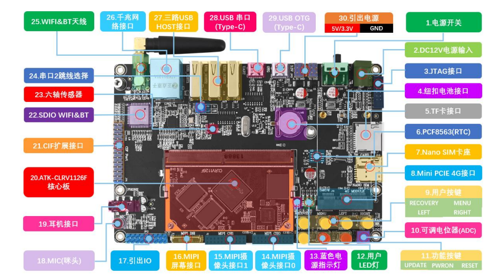
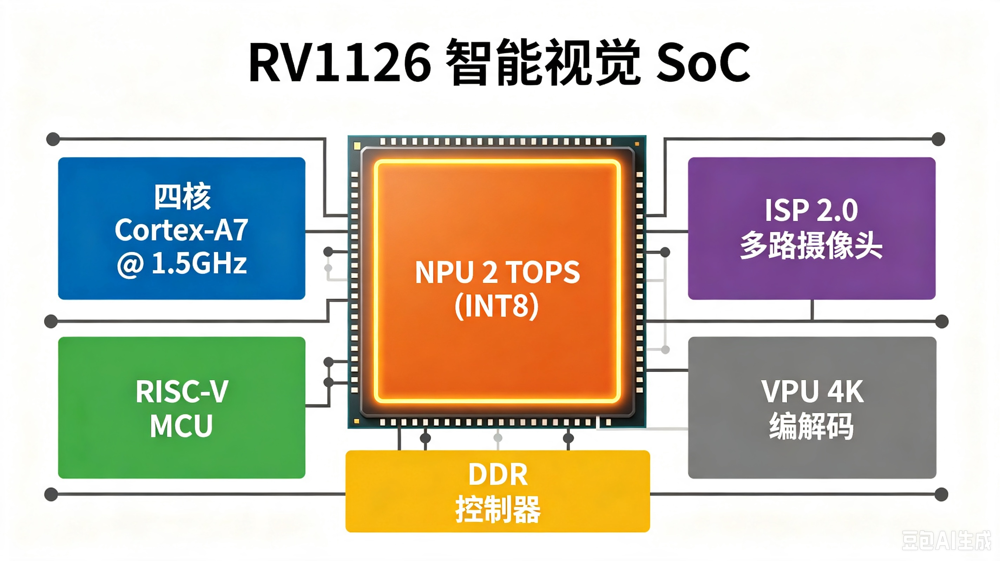
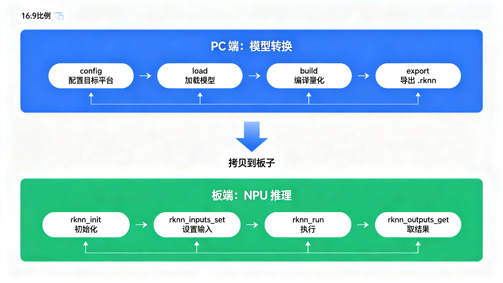

# 基于RV1126的端侧AI开发 · 第1期 准备工作及前序知识

> 定位：本系列主要学习RKNN 工具链的使用 + 模型部署，从转换、量化、板端推理到性能调优
> 配套硬件：正点原子 RV1126 开发板（已下架，最新为RV1126B）+ IMX415 + 5.5' MIPI LCD
> 参考文档：正点原子官方
> 参考视频：[从ARM到AI视觉：基于RV1126B的嵌入式AI开发](https://space.bilibili.com/519718611/channel/collectiondetail?sid=7928216&spm_id_from=333.788.0.0)

## 0. 本文目标

假设你是一个嵌入式软件工程师：会 C/C++、懂 MCU、RTOS、Linux、玩过摄像头和显示屏，但**第一次接触 AI 模型部署**。你可能有一块 RockChip 开发板，或者正打算买一块，然后被"RKNN""NPU""量化""TOPS"这些词淹没。

本文涉及四个问题：

1. **RV1126 到底是个什么东西？** 拆开 SoC 看结构，特别是那个 NPU 是干什么的；
2. **NPU、TOPS、INT8 是什么意思？** 
3. **RKNN 工具链是什么？** 为什么模型必须经过它才能在 NPU 上跑？**第一代（1.x）和第二代（Toolkit2）到底差在哪**——这是踩坑率最高的地方；
4. **开发板和 SDK 怎么准备？** 买板、连板、拿到 SDK 后先看什么。

## 1. RV1126：一块"带专用 AI 加速器"的 Linux SoC

### 1.1 先看整体

**定义 1（SoC, System on Chip）**：把 CPU、内存控制器、各种外设控制器集成到一颗芯片上的系统级芯片。RV1126 就是一颗典型的**智能视觉 SoC**——专门为摄像头类产品（IPC 网络摄像机、智能门禁、智能视觉盒子）设计的。


开发板资源图，摘自正点原子文档。



### 1.2 各模块在干什么

| 模块 | 规格 | 类比 |
|:---|:---|:---|
| CPU | 四核 Cortex-A7 @ 1.5GHz | 跑 Linux 和业务逻辑的"总管" |
| RISC-V MCU | 内置协处理器 | 低功耗待机场景的"看门小弟" |
| **NPU** | **2 TOPS（INT8）** | **专门干神经网络矩阵运算的"算力车间"** |
| ISP 2.0 | 多路摄像头图像处理 | 摄像头原始数据的"暗房"（去噪、白平衡、3A） |
| VPU | 4K 编解码 | 视频的"压缩打包机" |

## 2. NPU、TOPS、INT8：三个词讲清楚

### 2.1 NPU 是什么

**定义 2（NPU, Neural-network Processing Unit）**：专门为神经网络计算（主要是矩阵乘加）设计的专用处理器。

嵌入式类比：就像**DSP 之于音频、GPU 之于图形**——通用 CPU 也能算，但专用硬件算得又快又省电。NPU 就是"给神经网络专用的加速器"。

为什么 CPU 算不动神经网络？因为神经网络的核心是**大量并行的矩阵乘法**（我们主线系列里反复优化的 GEMM）。CPU 核心少、指令流串行，算一个 224×224 的分类模型要几百毫秒；NPU 用成百上千个乘加单元并行算，同样的活只要几十毫秒，功耗还低一个数量级。

### 2.2 TOPS 是什么

**定义 3（TOPS, Tera Operations Per Second）**：每秒执行一万亿次运算（Tera = 10¹²）。RV1126 的 NPU 是 **2 TOPS**，即每秒 2×10¹² 次运算——注意这里的"运算"通常指乘加。（最新RV1126B NPU算力 3 TOPS）

嵌入式直觉：MCU 的算力我们看 MIPS（每秒百万指令），NPU 的算力看 TOPS（每秒万亿次运算），一个天上一个地下。**2 TOPS 的绝对值不大**（现在手机 NPU 有几十 TOPS），但对 IPC 场景的轻量模型（分类、检测、人脸）绰绰有余。

### 2.3 INT8 是什么

**定义 4（INT8）**：8 位整数运算。NPU 的 TOPS 数字通常标注的是 INT8 精度下的算力——**精度越低，算力越高**（就像 MCU 上 8 位乘法比 32 位快）。

嵌入式类比：INT8 就是"定点数"（Q 格式），把浮点模型压缩成 8 位整数来算。为什么能这么做？因为神经网络的权重和激活值**对精度不敏感**——就像你用 8 位 ADC 采样温度也能满足控制需求一样。**把 FP32 模型变成 INT8 模型的过程叫量化**，这是本系列的重头戏（后面专门有一篇讲），现在只需要知道：**RV1126 的 2 TOPS 是 INT8 算力，模型要转成 INT8 才能吃满 NPU**。

## 3. RKNN 工具链：模型与硬件之间的"翻译官"

### 3.1 为什么要工具链

你训练（或下载）的模型是 TensorFlow / PyTorch / ONNX 格式——这是"通用世界"的描述。但 NPU 不认这些格式，它只认自己的一套指令和内存布局。**必须有一个工具把模型翻译成 NPU 能跑的格式。**

**定义 5（RKNN）**：瑞芯微 NPU 的模型格式与运行时（Runtime）总称。模型文件后缀是 **`.rknn`**，板子上通过 **`librknnmrt.so`** 这个运行时库来加载和执行它。（其他NPU厂商的模型文件格式各不相同，如华为昇腾NPU支持的模型文件后缀为`.om`）

嵌入式类比：**RKNN 工具链就是"深度学习版的交叉编译工具链"**：

```text
交叉编译：   C 源码 ──(gcc-arm)──▶ ARM 可执行文件 ──(loader)──▶ 板子上跑
RKNN：      ONNX/TFLite 模型 ──(rknn-toolkit)──▶ .rknn 模型 ──(librknnmrt)──▶ NPU 上跑
```

交叉编译时用 `aarch64-linux-gnu-gcc` 生成 ARM 指令；

RKNN 工具链在 PC 上把模型"编译"成 NPU 指令。

**模型转换 = 编译，.rknn 文件 = 可执行文件，librknnmrt = 动态链接库。**

### 3.2 RKNN 全流程（先有个整体印象）

【图2：RKNN 模型转换与部署全流程】

```text
┌─────────────── PC 端（模型转换） ───────────────┐
│  ONNX / TFLite 模型                              │
│      │ rknn.config(...)   配置目标平台/预处理     │
│      │ rknn.load_onnx(...) 加载模型              │
│      │ rknn.build(...)     编译（可量化）        │
│      ▼                                            │
│   model.rknn ──► export_rknn 导出                │
└───────────────┬───────────────────────────────────┘
                │ 拷贝到板子
┌───────────────▼─────────────── 板端（推理） ──────┐
│  rknn_init()       初始化 NPU 上下文              │
│  rknn_inputs_set() 设置输入（图像数据）           │
│  rknn_run()        NPU 执行推理                   │
│  rknn_outputs_get() 取回输出（类别/检测框）       │
└───────────────────────────────────────────────────┘
```


## 4. ⚠️ 第一代工具链 vs 第二代：最大的坑

这是本系列最重要的一个"先决知识"，先记住：

> **RV1109 / RV1126 系列使用 `rknn-toolkit` 1.6.x（第一代）；RV1126B / RK3566 / RK3568 / RK3588 使用 `RKNN-Toolkit2`（第二代）。两者完全不通用，教程、报错、API 都不能混用。**

| 项目 | 第一代 rknn-toolkit | 第二代 RKNN-Toolkit2 |
|:---|:---|:---|
| 适用芯片 | RV1109 / RV1126 | RV1126B / RK3566 / RK3568 / RK3588 / RK3576 |
| 版本号 | 1.7.x | 2.x（如 2.3.0） |
| Python 包名 | `rknn-toolkit` | `rknn-toolkit2` |
| 转换 API | `load_tensorflow / load_tflite / load_caffe / load_onnx` | `load_pytorch / load_onnx / load_tensorflow ...` |
| 板端运行时 | `librknnmrt.so` | `librknnrt.so` |
| 支持框架 | TF / TFLite / Caffe / ONNX | 更多（含 PyTorch 直转） |

## 5. 开发板与 SDK 准备

### 5.1 开发板选型

RV1126 生态里常见的板子：

| 开发板 | 特点 |
|:---|:---|
| 瑞芯微官方智慧视觉开发板 | 最全参考设计，文档最完整 |
| 正点原子 RV1126/RV1126B 板 | 资料全、社区活跃，网络教程丰富 |

### 5.2 SDK 是什么、装在哪

RV1126 的 SDK 是瑞芯微的 **Linux SDK**（Buildroot 方案），编译出整个板端系统镜像。SDK安装方式参见正点原子资料文档。

```text
~/RV1126/atk-rv1126-sdk$ tree -L 1
.
├── IMAGE
├── Makefile -> buildroot/build/Makefile
├── app
├── br.log
├── build.sh -> device/rockchip/common/build.sh
├── buildroot
├── device
├── docs
├── envsetup.sh -> buildroot/build/envsetup.sh
├── external
├── kernel
├── mkfirmware.sh -> device/rockchip/common/mkfirmware.sh
├── prebuilts
├── rkbin
├── rkflash.sh -> device/rockchip/common/rkflash.sh
├── rockdev
├── tools
└── u-boot
```

### 5.3 学习路径

**模型转换、量化和 PC 模拟推理不需要板子**——rknn-toolkit 在 PC 上就能完成转换和模拟执行。板端部署开始才需要真实硬件。想先体验的读者可以先把 PC 端跑通，再决定买不买板。

## 6. 小结

本节建立了整个系列的认知地图：

- **RV1126** = 四核 A7 Linux SoC + RISC-V MCU + **2 TOPS INT8 NPU** + ISP2.0 + 4K 编解码，是典型的智能视觉平台；
- **NPU/TOPS/INT8** = 神经网络专用加速器 / 每秒万亿次运算 / 8 位整数精度；
- **RKNN 工具链** = 模型与 NPU 之间的"交叉编译工具链"，把 ONNX/TFLite 翻译成 `.rknn`，板端用 `librknnmrt.so` 执行；
- **最大的坑** = RV1126 必须用第一代 `rknn-toolkit` 1.7.x，RKNN-Toolkit2 是 RK356x/3588 的，二者不通用；

下一节：把 PC 端环境装好，跑通第一个模型转换——"ONNX/TFLite → .rknn"这一步走通，整个系列的地基就稳了。

> 🏷️ 标签：#RV1126 #RKNN #NPU #TOPS #INT8 #瑞芯微 #智能视觉
